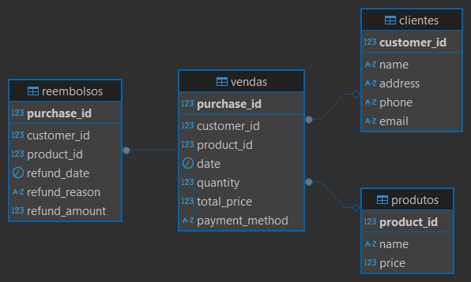

# 📺 Projeto dbt - StreamBR

Este projeto modela os dados de uma plataforma fictícia de streaming chamada **StreamBR**, utilizando o **Data Build Tool (dbt)** para transformar, documentar e testar os dados de forma estruturada e analítica.

---


## 🎯 Objetivo do Projeto

O objetivo deste projeto é construir um **Data Warehouse analítico**, organizado em camadas conforme as boas práticas recomendadas pelo **dbt**. A arquitetura proposta permitirá análises confiáveis e estruturadas sobre **assinantes, planos de assinatura, vendas e estornos**.

Além disso, o projeto oferece uma visão completa **End-to-End (E2E)** — desde a modelagem e transformação dos dados até o deploy e agendamento no ambiente em nuvem.


---
## 📁 Fontes de dados

Na pasta `scripts-sql`, estão disponíveis os scripts responsáveis pela criação das tabelas que serão utilizadas ao longo deste projeto.

> **Observação:** A tabela de estornos será materializada a partir dos dados presentes na pasta `seed`.


### 💡 Modelo de negócio

Na StreamBR os assinantes contratam planos de assinatura (Básico, Padrão, Premium, Família, Esportes, entre outros). Cada venda representa a contratação de um plano pré-pago por uma quantidade de meses, e o valor pago pode variar conforme promoções do período. Os estornos de cobrança (cobrança indevida, serviço indisponível, cobrança duplicada etc.) são registrados à parte e carregados no data warehouse via seed.

---


## 🧬 Diagrama Relacional das Tabelas de Origem




## 🧱 Boas Práticas por Camada no dbt

## 🔹 Camada `staging`

| Prática recomendada                       | Descrição                                                                 |
|-------------------------------------------|---------------------------------------------------------------------------|
| Prefixo `stg_` nos modelos                | Nomeie os modelos como `stg_<nome_tabela>`                               |
| Seleção explícita de colunas              | Evite `SELECT *`; selecione e renomeie as colunas manualmente            |
| Padronização de nomes                     | Use `snake_case` e nomes consistentes como `order_id`, `customer_id`     |
| Limpeza básica                            | Remova duplicatas, trate nulos e converta tipos quando necessário        |
| Sem regras de negócio                     | Deixe regras complexas para camadas `intermediate` ou `marts`            |
| Uso de `source()`                         | Sempre referencie dados brutos com `source('fonte', 'tabela')`           |
| Organização por fonte                     | Estruture os modelos em subpastas por origem dentro de `models/staging/` |
| Inclusão de testes                        | Aplique testes de unicidade, nulos e integridade                         |
| Documentação dos modelos                  | Use arquivos `.yml` para descrever campos e tabelas                      |

---

## 🔸 Camada `intermediate`

| Prática recomendada                         | Descrição                                                                 |
|---------------------------------------------|---------------------------------------------------------------------------|
| Prefixo `int_` nos modelos                  | Nomeie os modelos como `int_<entidade>`                                   |
| Combinação de dados                         | Faça joins, merges e enriquecimentos entre várias tabelas                 |
| Criação de entidades derivadas              | Crie entidades intermediárias como `orders_enriched`, `active_customers` |
| Separação de responsabilidades              | Mantenha uma transformação por modelo sempre que possível                 |
| Simplificação para os marts                 | Prepare modelos limpos e organizados para uso direto nos marts            |
| Reutilização e manutenção                   | Centralize lógicas complexas para evitar duplicidade em modelos finais    |
| Uso de `ref()` para `stg_`                  | Sempre referencie os modelos `staging` via `ref('stg_xxx')`               |

---

## 🟢 Camada `marts`

| Prática recomendada                       | Descrição                                                                  |
|-------------------------------------------|----------------------------------------------------------------------------|
| Prefixo `fct_`, `dim_`, `report_`         | Use `fct_` para fatos, `dim_` para dimensões, `report_` para relatórios    |
| Modelos prontos para o negócio            | Cada modelo deve ser útil diretamente para o analista ou consumidor final |
| Cálculos e KPIs finais                    | Faça agregações, métricas e cálculos de negócio                           |
| Uso de `ref()` para `int_` e `dim_`       | Referencie modelos intermediários ou dimensões derivadas                  |
| Nomeação clara e orientada ao domínio     | Nomeie modelos conforme as entidades do negócio                           |
| Organização por áreas de negócio          | Separe os modelos por temas: vendas, finanças, marketing etc.             |
| Modelos versionáveis                      | Mantenha versões (ex: `fct_sales_v1`) se precisar evoluir sem quebrar     |

---

## 🧩 Comparativo entre Camadas

| Aspecto                       | staging                         | intermediate                          | marts                                 |
|------------------------------|----------------------------------|----------------------------------------|----------------------------------------|
| Prefixo                      | `stg_`                           | `int_`                                 | `fct_`, `dim_`, `report_`              |
| Fonte de dados               | `source()`                       | `ref(stg_)`                            | `ref(int_)`, `ref(dim_)`              |
| Tipo de transformação        | Limpeza e padronização           | Joins, enriquecimentos, lógicas        | Métricas, agregações, KPIs            |
| Complexidade da lógica       | Baixa                            | Média                                   | Alta                                   |
| Público alvo                 | Interno (engenharia)             | Interno (engenharia/analytics)         | Final (análise/negócio)                |
| Objetivo principal           | Padronizar dados brutos          | Preparar dados relacionais e reutilizáveis | Responder perguntas de negócio     |
| Organização recomendada      | Por fonte                        | Por entidade                           | Por área de negócio                    |

[Fonte - dbtLabs](https://docs.getdbt.com/best-practices/how-we-structure/1-guide-overview)

---

## ✅ Pré-requisitos

Para executar este projeto, você precisará ter o seguinte ambiente configurado:

- 🐍 **Python 3.8+** – [Download](https://www.python.org/downloads/)
- 🐘 **PostgreSQL via RDS (AWS)** ou outro banco compatível
- 💻 **DBeaver** (cliente SQL opcional para explorar dados) – [Download](https://dbeaver.io/download/)
- ☁️ **Conta gratuita no dbt Cloud** – [Criar conta](https://cloud.getdbt.com/signup/)
- 🛠️ **Git** – necessário para versionamento e integração com o dbt Cloud - [Download](https://git-scm.com/downloads)
- 🐙 **Conta no GitHub** – necessária para hospedar o repositório do projeto e integrar ao dbt Cloud [Criar conta](https://github.com/join)
- 📦 **Pacote `dbt-postgres` versão 1.9 ou superior**  
  Instale com o comando:  
  ```bash
  pip install dbt-postgres
  ```

## 🚀 Deploy

O deploy é realizado por meio do **dbt Cloud (plano gratuito)**, utilizando uma instância **RDS na AWS** também dentro da camada **Free Tier**. Essa abordagem permite orquestrar e agendar execuções dos modelos dbt de forma prática, sem custos adicionais no ambiente de desenvolvimento.

---

## 📺 Sobre o Projeto

A StreamBR é uma plataforma de streaming fictícia. O projeto foi desenvolvido como estudo prático durante a pós-graduação em **Engenharia de Dados e Inteligência Artificial** e cobre o ciclo completo: carga dos dados brutos no PostgreSQL, transformação em camadas, testes de qualidade, documentação e orquestração no dbt Cloud.
